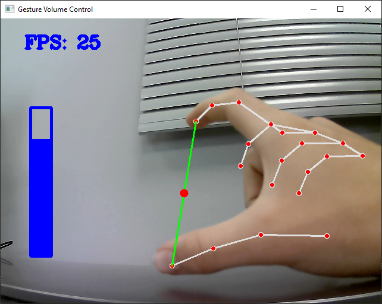

# 🔊 Gesture Volume Control (Python + OpenCV + MediaPipe + Pycaw)

A real-time hand gesture-based volume control system using your webcam. By tracking the distance between your thumb and index finger, the system adjusts the system audio volume dynamically.



---

## 🎯 Features

- Control system volume with hand gestures
- Real-time FPS display
- Smooth tracking using **MediaPipe**
- Integrated system audio control using **pycaw**
- Modular hand tracking with a reusable `HandTrackingModule`

---

## 🧰 Requirements

- Python 3.7+
- OpenCV (`cv2`)
- [MediaPipe](https://pypi.org/project/mediapipe/)
- `pycaw` (Windows audio control)
- `numpy`

Install all dependencies via pip:

```bash
pip install opencv-python mediapipe pycaw comtypes numpy
```

---

## 🗂 Folder Structure

```
gesture-volume-control/
├── HandTrackingModule.py      # Contains handDetector class
├── main.py                    # Main script for volume control
```

---

## 🚀 How It Works

- OpenCV captures video from your webcam.
- MediaPipe detects hand landmarks.
- The distance between **thumb (id 4)** and **index finger (id 8)** is calculated.
- This distance is mapped to the system volume range using `pycaw`.
- A volume bar and FPS counter are displayed in real time.

---

## 📦 HandTrackingModule

A custom module that wraps **MediaPipe** hand detection and provides:

| Method            | Description                                  |
|------------------|----------------------------------------------|
| `findHands()`     | Detects and optionally draws hand landmarks  |
| `findPosition()`  | Returns list of landmark coordinates         |
| `fingersUp()`     | Detects which fingers are raised             |
| `Distance()`      | Calculates distance between two landmarks    |

---

## 🖥️ Running the Project

1. Ensure your webcam is connected and Python is set up.
2. Run the main script:

```bash
python main.py
```

3. Use your **thumb and index finger** to increase/decrease volume.

> Press `ESC` to exit.

---

## 📷 Screenshot (Optional)

*Add a screenshot of the volume control in action if desired.*

---

## 👨‍💻 Author

- [Oliver](https://github.com/jollyolliel)


